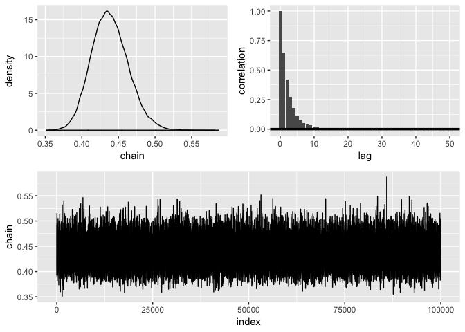
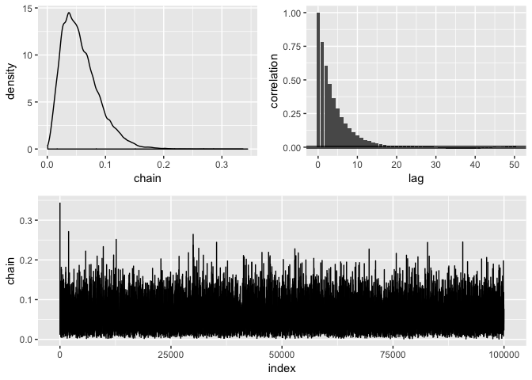

binfer
================

This package aims to make doing Bayesian things a little easier by giving a clear set of steps that you can easily use to simulate draws from a posterior distribution defined by a specific likelihood and prior.

The steps
---------

1.  `define` a likelihood

-   Input: A data frame, a formula with the response variable and the name of a function that is your likelihood.
-   Output: A data frame with the name of the function given at input as an attribute

1.  `assume` a prior distribution

-   Input: A data frame and a function of a single variable
-   Ouput: A data frame with the name of the function added as an attribute

1.  `simulate` the posterior distribution

-   Input: A data frame, a control parameter
-   Output: A data frame of draws from the posterior distribution

1.  `diagnose` the chain:

-   Input: a data frame of draws from the posterior
-   Output: The same data frame and a bunch of diagnostic plots

1.  `clean` the chain

-   Input: Draws from the posterior
-   Output: Burned-in and subsampled draws from the posterior

1.  Construct your confidence interval or p-value

-   Use `dplyr` for this

Examples
--------

Estimate the standard deviation of a normal distribution with a uniform prior:

``` r
library(binfer)
library(tidyverse)
#> Loading tidyverse: ggplot2
#> Loading tidyverse: tibble
#> Loading tidyverse: tidyr
#> Loading tidyverse: readr
#> Loading tidyverse: purrr
#> Loading tidyverse: dplyr
#> Conflicts with tidy packages ----------------------------------------------
#> filter(): dplyr, stats
#> lag():    dplyr, stats

my_lik <- function(data, theta) {if (theta > 0) dnorm(data, mean = mean(iris$Sepal.Width) , sd = theta) else 0}
my_prior <- function(theta) {dunif(theta, min = .0001, max = 10)}

posterior <- define(iris, Sepal.Width ~ my_lik) %>% 
  assume(prior = ~ my_prior) %>% 
  simulate_posterior(initial = .43, nbatch = 1e5, blen = 1, scale = .15) %>% 
  diagnose() %>% 
  clean(burnin = 0, subsample = 20) %>% 
  diagnose()
#> Acceptance rate: 0.207612076120761
#> Acceptance rate: 0.988997799559912
```



``` r

posterior %>% summarise(mean = mean(chain),
                        sd = sd(chain),
                        lower = quantile(chain, .025),
                        upper = quantile(chain, .975))
#>        mean         sd     lower     upper
#> 1 0.4379237 0.02568786 0.3921555 0.4927983
```

Estimate the probability of success of a binomnial distribution with a beta prior:

``` r
binom_test_data <- rbinom(50, prob = .01, size = 1) %>% 
  tibble(response = .)

binom_lik <- function(data, theta) {if(theta > 0 & theta < 1) dbinom(data, prob = theta, size = 1) else 0}
beta_prior <- function(theta) {dbeta(theta, 1, 1)}

posterior2 <- binom_test_data %>% 
  define(response ~ binom_lik) %>% 
  assume(~ beta_prior) %>% 
  simulate_posterior(initial = .5, nbatch = 1e5, blen = 1, scale = .05) %>% 
  diagnose() %>% 
  clean(burnin = 1000, subsample = 30) %>% 
  diagnose()
#> Acceptance rate: 0.274772747727477
#> Acceptance rate: 0.997575022734162
```



``` r
posterior2 %>% 
  summarize(mean = mean(chain), 
            sd = sd(chain), 
            lower = quantile(chain, .025), 
            upper = quantile(chain, .975))
#>         mean         sd        lower     upper
#> 1 0.01947524 0.01919843 0.0005679145 0.0683282
```
